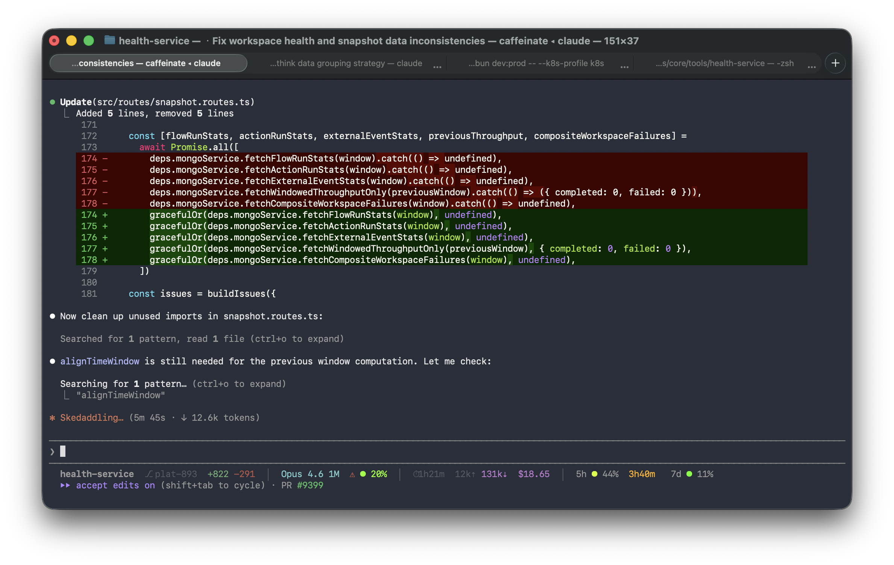

# Claude Code Status Line

Context, cost, and quota at a glance.



## Install

```bash
curl -fsSL https://raw.githubusercontent.com/mhagmajer/claude-code-statusline/main/statusline-command.sh | sh -s -- --install
```

## What you get

```
health-service  plat-893  +822 -291  |  Opus 4.6 1M  * 20%  |  @1h21m  12k^ 131k v  $18.65  |  5h * 44%  3h40m  7d * 11%
'-----------v-----------'  '------v------'  '--------v--------'  '--------v--------'
         Where                 Engine             Activity               Quota
```

| Group | What it shows | Why it matters |
|-------|--------------|----------------|
| **Where** | Path, branch, lines changed | What am I working on? |
| **Engine** | Model + context window fill % | Am I running out of context? |
| **Activity** | Duration, tokens in/out, cost | How much is this session costing? |
| **Quota** | 5h/7d rate limits + reset timer | Will I get throttled? |

## Color coding

- **Green to red gradient** (11-step, 256-color) on context %, quota %, and reset timer
- **Magenta** for output tokens and cost (output is the main cost driver)
- **Dim** for input tokens (cheap when cached)
